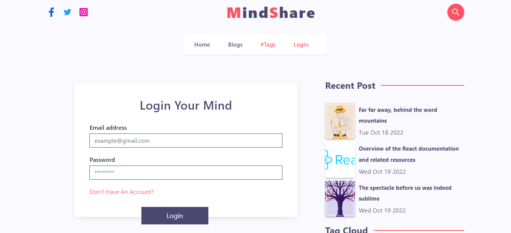
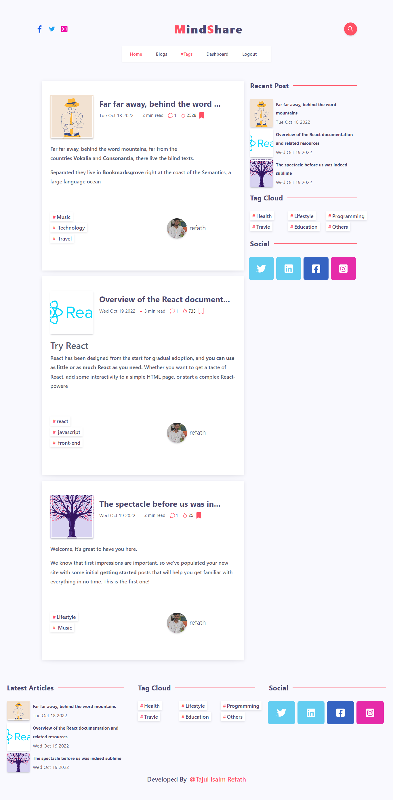
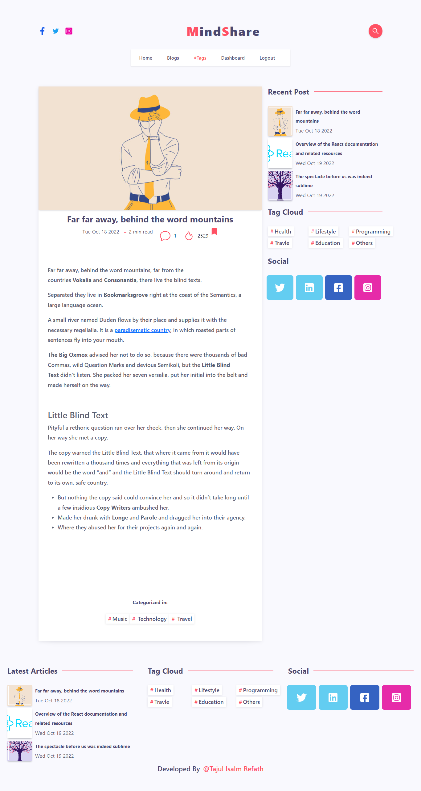
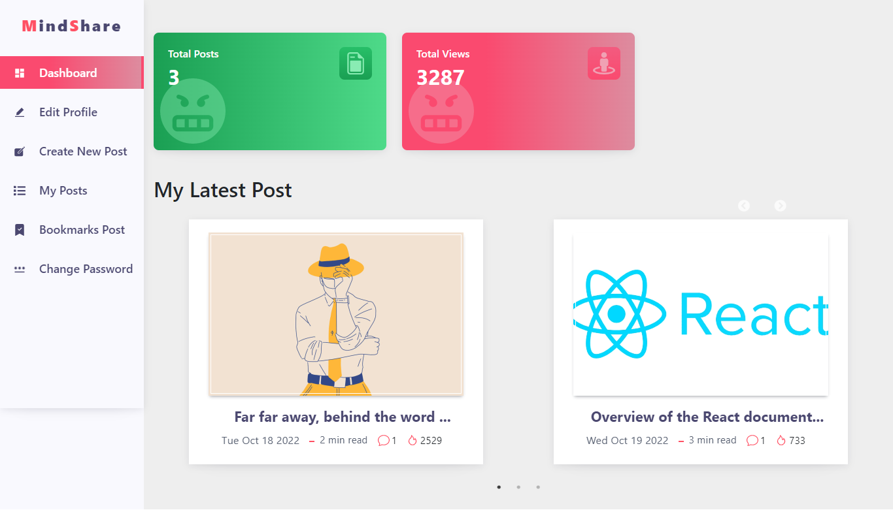

# This Is A Multi Author MERN Blog Project

## Some key Feature of this project is !

- OTP send by email for user registration
- UI Develop by using React-js
- Use Reduex-toolkit for store management
- Every user can create a post
- For writing post body I use TinyMCE text editor
- User saved post as bookmarks
- User can search posts using

